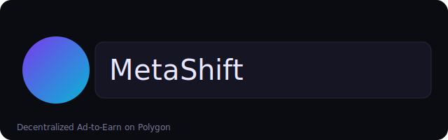

# MetaShift — Decentralized Ad‑to‑Earn on Polygon

MetaShift is a Web3 advertising network where advertisers pay for attention, and hosts/viewers earn crypto for displaying or engaging with ads. It’s like BAT, but fully decentralized, Polygon‑powered, with AI verification and on‑chain payouts. SideShift is used to auto‑swap rewards to the recipient’s preferred asset.

## What MetaShift Does
- Advertisers rent on‑chain ad slots and fund campaigns in MATIC/USDC (or ERC‑20).
- Hosts mint NFT “ad slots,” embed a small snippet on their sites/dApps, and earn from impressions.
- Viewers earn micro‑rewards for verified views/interactions.
- Payouts are split automatically (default 70% Host / 20% Viewer / 10% Treasury) and can be auto‑swapped via SideShift.

## How It Works

1) Advertiser submits ad creative + budget → Smart contract escrows funds.
2) Host’s site loads the embed snippet → fetches ad creative to display.
3) A verified view occurs → backend calls `payView` on‑chain.
4) Contract splits payment: Host, Viewer, Treasury.
5) Optional: recipients swap rewards using SideShift API.

## User Roles
- Advertiser: creates campaigns, funds them, tracks performance.
- Host (Developer/Website Owner): mints ad‑slot NFT, embeds snippet, earns payouts.
- Viewer: connects wallet; verified attention earns micro‑rewards.

## Tech Stack
- Blockchain: Polygon (Amoy testnet / Mainnet)
- Contracts: Solidity, Hardhat, OpenZeppelin
- Frontend: Next.js (App Router), Tailwind, RainbowKit, wagmi, viem, Ethers v6, Zustand, React Query
- Data/Indexing: The Graph (subgraph placeholder included)
- Payments/Swap: SideShift API (quotes + orders)
- AI Verification: API stub ready for provider integration

## Deployed (Amoy Testnet)
- `AdSlotNFT`: 0x5771b9368a1d5beB88861b7bb4C44c467966058f
- `MetaShiftAdManager`: 0xA5F95992d40782f3844e7B8BA5117fe05c4E530f

Update these in the web app env before running locally.

## Monorepo Layout
- `contracts/` — Hardhat project, Solidity contracts, deploy script
- `web/` — Next.js app (advertiser + host dashboards, API routes)
- `subgraph/` — The Graph notes (placeholder)

## Quick Start (Dev)
1) Contracts (Polygon Amoy)
   - Set `.env` in `contracts/`:
     - `ALCHEMY_POLYGON_RPC=...`
     - `POLYGON_PRIVATE_KEY=0x...`
     - `METASHIFT_TREASURY=0xYourTreasury`
   - Compile & Deploy:
     - `npx hardhat compile`
     - `npx hardhat run scripts/deploy.ts --network amoy`
   - Save printed addresses.

2) Web App
   - Set `.env.local` in `web/`:
     - `NEXT_PUBLIC_SLOT_ADDRESS=...`
     - `NEXT_PUBLIC_MANAGER_ADDRESS=...`
     - `NEXT_PUBLIC_WALLETCONNECT_ID=demo` (or your WC ID)
     - `NEXT_PUBLIC_BASE_URL=http://localhost:3000`
     - `POLYGON_RPC=...` (Amoy RPC)
     - `SERVER_SIGNER_KEY=0x<low_priv_dev_key_with_test_MATIC>`
     - `SIDESHIFT_API_KEY=<your_sideshift_api_key>`
   - Run: `npm run dev`

3) Use It
   - Host: `/host` → mint ad slot → copy embed snippet.
   - Advertiser: `/advertiser` → create + fund a campaign.
   - Test a payout: POST `/api/payView` with `{ id, viewer, nonce }`.

## Production Hardening
- Replace server‑side signer with user‑signed tx flows or a secure backend service.
- Add robust AI moderation + fraud detection before paying views.
- Move view verification off of simple endpoints to an oracle/attestation flow.
- Build a real subgraph and analytics dashboard.
- Add allowlisting, rate limits, and signature checks to API routes.

## Security Notes
- Treat private keys as secrets. Rotate any exposed keys.
- Use separate keys for deployer, treasury, and server tasks.
- Consider multisig or timelocks for treasury and config changes.

## License
MIT. See headers in contract files.

